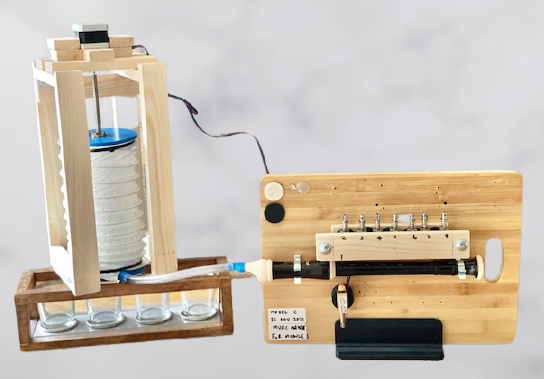

# Music Makers

## Robotic Recorder Player

This project is an open source hardware project that is intended to be an automated way to play a recorder instrument. Build it for yourself and use the [Python Interface](Python_Interface) to send your MIDI files to the robotic recorder player and hear them played on the recorder!



## How to Build and Use

This project had been designed so that it only requires a limited toolset and you don't have to be an expert to build it. An overview is below but more detailed instructions can be found in each folder.

### Tools Required
- FDM 3D Printer and slicer software.
- Basic workshop tools including spanners, screwdrivers, allen keys, drill.
- A computer with the Arduino IDE and Python installed.

### Build process
1. Get the hardware you need (you may even have some of what you need!) and follow the [Hardware build instructions](Hardware/README).
3. Upload the [Firmware](Firmware) to the Arduino.
4. Load the [Python Interface](Python_Interface) onto your computer.

### Play a Song
1. Create your song in MIDI format as a `.mid` file ([guide](Python_Interface/README.md#creating-mid-files)), use one of our [examples](Python_Interface/midi_examples), or find one someone else has made.
2. Connect your computer to the robotic recorder player and use the [Python Interface](Python_Interface) to hear your song played on the recorder!


## Project Development
This is an open souce hardware project and anyone is welcome to use and develop this project in line with the licences. We also encourage anyone interested to contribute to this development, especially in the areas outlined below.

### Development Areas
These are some of the areas we intend to focus future development:
- **Double-sided or twin lung** hardware and control to allow playing with reduced pauses.
- **Half-hole thumb technique** to reach highest notes.
- **Tounging mechanism** to implement the tounging technique and achieve staccato notes.
- **Increase OSH depth** adapt the project to depend more on open source components.
- **Improved usability** through an improved, maybe graphical, user interface.
- **Improved documentation** and build instructions.
- **Increased robotic intelligence** such as giving foresight of notes to make decisions on breathing.
- **Expanded scope of calibration** to include timing and facilitate robot musicians playing together.

### How to Contribute

Contributing to the project is easy and we encourage anyone who is interested to make pull requests. 

The general process of contributing on GitHub is widely documented however the outline process is below:

1. Identify where you want to host the project locally. This could be a Music makes projects folder for example. 


1. Clone or fork the repository using GitHub desktop or the CLI into this location (CLI is recommended as this helps you become more familiar with Git in general). You can do this with the following command:

    ```bash
    git clone https://github.com/ICMC22-tmp/OSH_Automated_Recorder
    ```

1. Update the project and then make a pull request!


## Other Robotic and Autonomous Music Players

Just for fun we thought it would be interesting to include other robotic music players. They range from the sublime to the wacky, but each one is beautiful. 

- Squarepusher x Z-Machines https://www.youtube.com/watch?v=VkUq4sO4LQM&t=66s
- Andrew Henry's self playing guitar https://www.youtube.com/watch?v=I_BBCmcAXcs
- Waseda Flutist Robot https://www.youtube.com/watch?v=jx8U1FgILCE
- The original Flute automaton - Floutiste https://www.youtube.com/watch?v=1TxrjpWGRXU
- A variety of robotic players including violin, piano, guitar, bongos, xylophone and others https://www.youtube.com/watch?v=rwh_acqT6J0
- Wintergaten - Marble machine https://www.youtube.com/watch?v=IvUU8joBb1Q
- Automatica - Robots Vs Music https://www.youtube.com/watch?v=bAdqazixuRY
- Music genie - Hierarchical Music https://www.youtube.com/playlist?list=PLjrJD5nSYNjoQebwV7TWPe83k7g2FjIO6


## Acknowledgements

The inspiration for this project was Andrew Henry's <a href="https://gitlab.com/Andrew_Henry/automated-guitar">automated guitar player</a>.

## License

This project is licensed under the [GNU General Public License v3.0](LICENSE) and [CERN-OHL-W](LICENCE)
